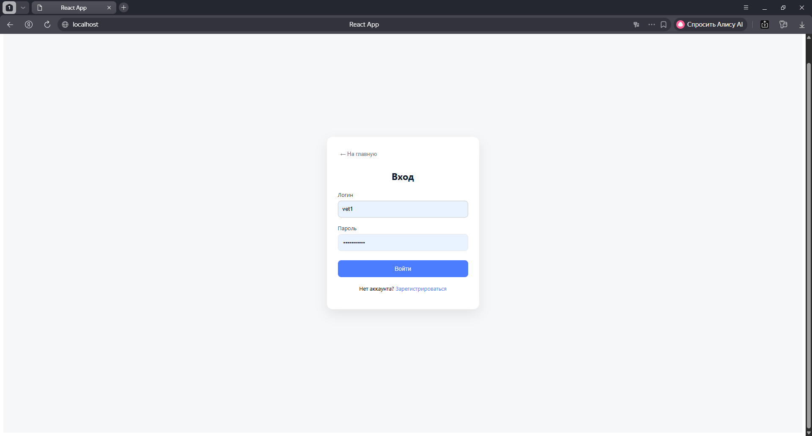
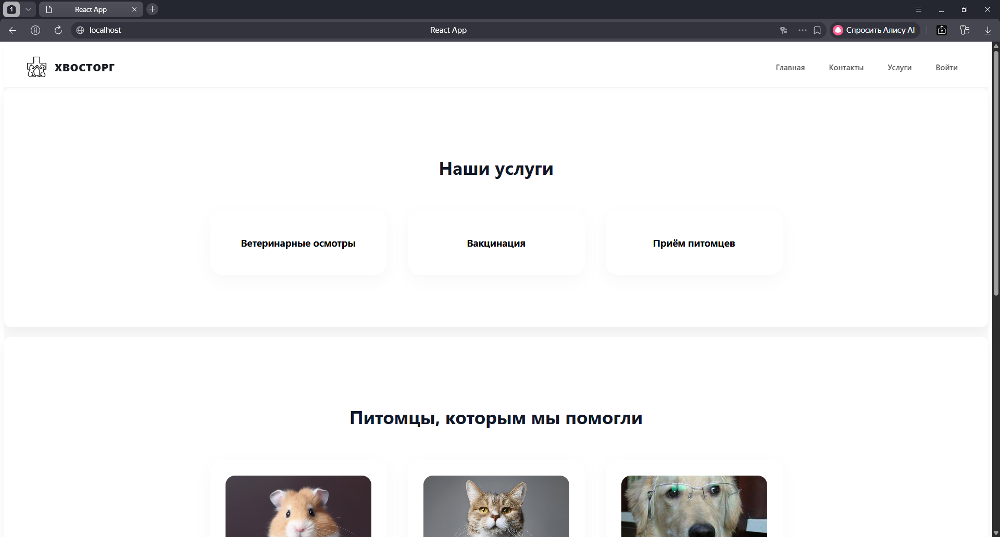
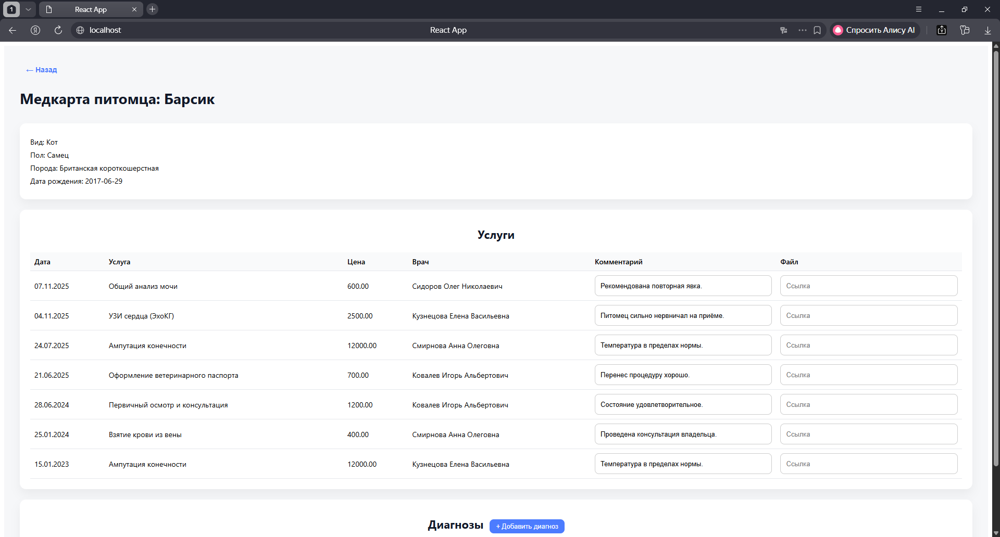
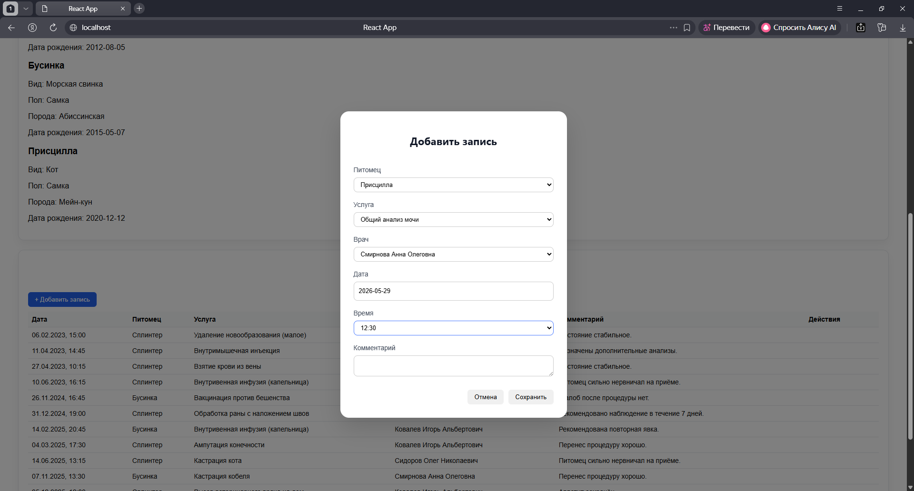

# Информационная система ветеринарной клиники

## Описание проекта

Информационная система ветеринарной клиники предназначена для автоматизации основных бизнес-процессов медицинского учреждения. Система позволяет вести учет клиентов и животных, управлять расписанием приемов, хранить медицинские карты, контролировать склад медикаментов и расходных материалов, а также обеспечивать удобную работу сотрудников клиники.

Проект разработан в рамках выпускной квалификационной работы.

---

## Основные возможности

- Авторизация пользователей с разграничением прав доступа.
- Управление клиентами и их питомцами.
- Создание и редактирование медицинских карт.
- Запись пациентов на прием.
- Просмотр расписания врачей.
- Управление услугами клиники.
- Учет медикаментов и расходных материалов.
- Просмотр истории посещений.
- Административная панель для управления системой.

---

## Используемые технологии

### Backend

- Python 3.12
- Flask
- SQLAlchemy
- Flask-JWT-Extended
- Flask-CORS

### Frontend

- React
- JavaScript
- HTML5
- CSS3
- Axios

### База данных

- PostgreSQL

### Контейнеризация

- Docker
- Docker Compose

---

## Структура проекта

```
project/
│
├── backend/
│   ├── app/
│   ├── models/
│   ├── routes/
│   ├── services/
│   ├── config.py
│   └── requirements.txt
│
├── frontend/
│   ├── src/
│   ├── public/
│   └── package.json
│
├── docker-compose.yml
├── README.md
└── .env
```

---

## Установка

### 1. Клонировать репозиторий

```bash
git clone https://github.com/username/vet-clinic.git
cd vet-clinic
```

### 2. Создать файл окружения

Создать файл `.env` и указать необходимые параметры подключения к базе данных.

Пример:

```env
POSTGRES_DB=vetclinic
POSTGRES_USER=postgres
POSTGRES_PASSWORD=password
SECRET_KEY=secret
JWT_SECRET_KEY=jwtsecret
```

---

## Запуск через Docker

```bash
docker-compose up --build
```

После запуска будут доступны:

- Frontend — http://localhost:3000
- Backend API — http://localhost:5000

---

## Запуск без Docker

### Backend

```bash
cd backend

python -m venv venv

# Windows
venv\Scripts\activate

pip install -r requirements.txt

python app.py
```

### Frontend

```bash
cd frontend

npm install

npm start
```

---

## Использование

После запуска пользователь может:

- зарегистрироваться или войти в систему;
- добавить владельца животного;
- зарегистрировать питомца;
- оформить запись на прием;
- заполнить медицинскую карту;
- управлять услугами и складом.

---

## Архитектура

Проект построен по клиент-серверной архитектуре.

- React отвечает за пользовательский интерфейс.
- Flask предоставляет REST API.
- PostgreSQL хранит данные.
- JWT используется для аутентификации пользователей.

---

## Скриншоты

### Авторизация



### Главная страница



### Карточка пациента



### Запись на прием



## Автор

Карина

Выпускная квалификационная работа

Направление подготовки: Информатика и вычислительная техника.
